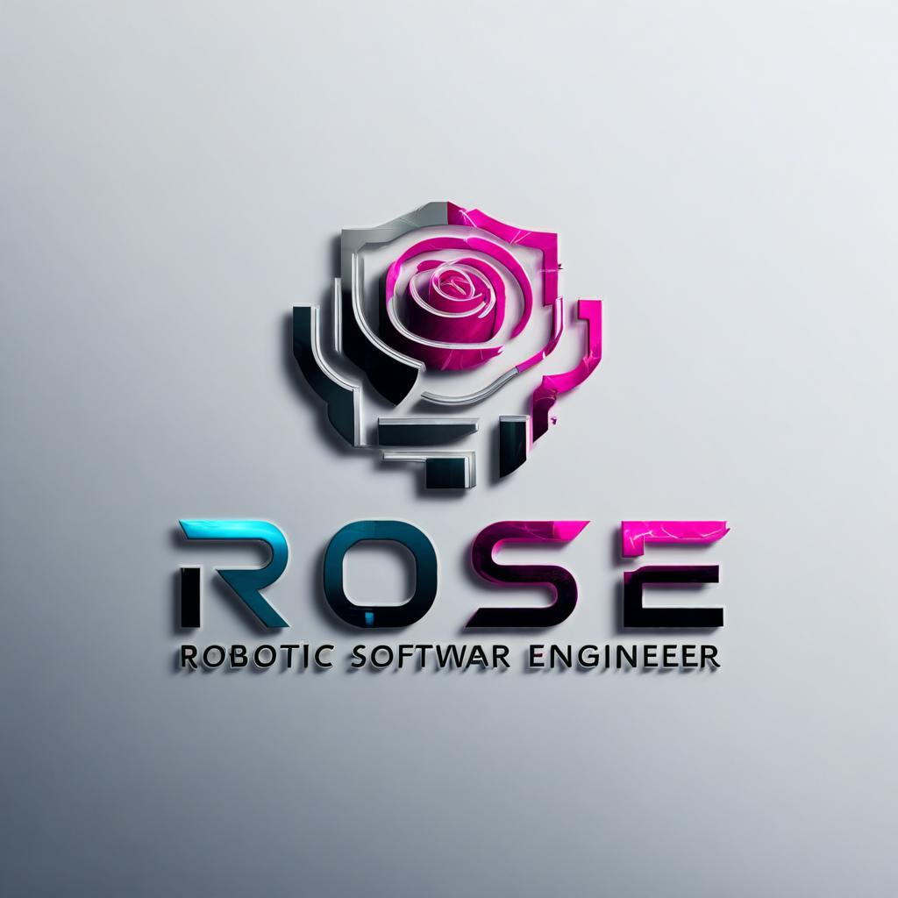

<p align="center">
  
</p>

# RoSE (Robotic Software Engineer)

RoSE is an advanced AI-powered development environment that combines intelligent assistance with robust development tools. It provides an integrated workspace for software development with real-time AI assistance, file management, code editing, and terminal access—all in a sleek, modern interface.

## What is RoSE?

RoSE is designed to enhance developer productivity by providing:

- **AI-Powered Assistance**: Get intelligent code suggestions, explanations, and problem-solving help
- **Integrated Development Environment**: Code editor, file explorer, and terminal in one interface
- **Container-Based Architecture**: Isolated, reproducible development environments
- **Modern UI**: Professional dark-themed interface with a clean, intuitive design

Whether you're building a new application, exploring code, or learning programming concepts, RoSE provides the tools and AI assistance to make your development process more efficient and enjoyable.

## Quick Start

### Prerequisites

- [Docker](https://docs.docker.com/get-docker/) and [Docker Compose](https://docs.docker.com/compose/install/)
- [Node.js](https://nodejs.org/) 20.x or later
- [OpenAI API key](https://platform.openai.com/api-keys) for AI features

### Installation

1. **Clone the repository**
   ```bash
   git clone https://github.com/yourusername/RoSE.git
   cd RoSE
   ```

2. **Set up environment variables**
   ```bash
   cp .env.example .env
   ```
   Edit the `.env` file and add your OpenAI API key:
   ```
   OPENAI_API_KEY=your_api_key_here
   ```

3. **Initialize the database**
   ```bash
   chmod +x init-db.sh
   ./init-db.sh
   ```

4. **Build and start the containers**
   ```bash
   docker compose up --build
   ```

5. **Access the application**
   
   Open your browser and navigate to:
   - Main UI: [http://localhost:8090](http://localhost:8090)

## Detailed Installation Guide

### System Requirements

- **Operating System**: Windows, macOS, or Linux
- **CPU**: 4+ cores recommended
- **RAM**: 8GB minimum, 16GB+ recommended
- **Storage**: 10GB+ free space
- **Docker**: Latest stable version
- **Node.js**: v20.x or later
- **Internet Connection**: Required for AI features and container image downloads

### Step-by-Step Installation

1. **Install Docker and Docker Compose**
   
   Follow the official installation guides:
   - [Docker Desktop for Windows/Mac](https://www.docker.com/products/docker-desktop)
   - [Docker Engine for Linux](https://docs.docker.com/engine/install/)
   - [Docker Compose](https://docs.docker.com/compose/install/)

2. **Install Node.js**
   
   Download and install from [nodejs.org](https://nodejs.org/) or use a version manager like [nvm](https://github.com/nvm-sh/nvm).

3. **Clone the repository**
   ```bash
   git clone https://github.com/yourusername/RoSE.git
   cd RoSE
   ```

4. **Configure environment variables**
   ```bash
   cp .env.example .env
   ```
   
   Edit the `.env` file with your preferred text editor and add:
   ```
   OPENAI_API_KEY=your_api_key_here
   ```

5. **Initialize the database**
   ```bash
   chmod +x init-db.sh
   ./init-db.sh
   ```
   
   This script will:
   - Create a default .env file if none exists
   - Start the PostgreSQL container
   - Wait for PostgreSQL to be ready
   - Start the container orchestrator
   - Run all database migrations

6. **Build and start all containers**
   ```bash
   docker compose up --build
   ```
   
   For headless/background mode:
   ```bash
   docker compose up --build -d
   ```

7. **Verify installation**
   
   Check that all services are running:
   ```bash
   docker compose ps
   ```
   
   You should see all containers in the "Up" state.

## Using RoSE

### Accessing the Interface

Once all containers are running, access the main interface at:
- [http://localhost:8090](http://localhost:8090)

### Main Features

#### 1. Project Management
- Create new projects or open existing ones from the home page
- Save project versions and track changes
- Import/export projects as ZIP files

#### 2. Code Editor
- Syntax highlighting for multiple languages
- Code completion and error checking
- Multiple file editing with tabs
- Customizable editor settings

#### 3. File Explorer
- Browse, create, rename, and delete files and directories
- Upload and download files
- Context menu for common operations

#### 4. Terminal
- Full-featured terminal access
- Run commands directly in the development environment
- View command output in real-time
- Execute common operations with quick-access buttons

#### 5. AI Assistant
- Get code suggestions and explanations
- Ask questions about programming concepts
- Request help with debugging and problem-solving
- Generate code snippets based on natural language descriptions

### Common Tasks

#### Creating a New Project
1. Navigate to the home page
2. Click "New Project"
3. Enter a name and description
4. Choose a template or start from scratch
5. Click "Create"

#### Working with Files
1. Use the file explorer to navigate directories
2. Double-click files to open them in the editor
3. Right-click for context menu options
4. Use the "+" button to create new files or directories

#### Using the Terminal
1. Click on the terminal panel at the bottom
2. Enter commands as you would in a regular terminal
3. Use the quick-access buttons for common operations
4. Toggle the container info panel for system details

#### Getting AI Assistance
1. Type your question or request in the chat panel
2. Press Enter or click the send button
3. View the AI's response in the chat
4. Apply code suggestions directly to your files

## Architecture Overview

RoSE consists of several Docker containers that work together:

### Main Components

1. **UX (Frontend)**
   - React/Vite application with modern UI components
   - Provides interface for file management, terminal access, and AI interactions
   - Port: 8090

2. **Dev Container**
   - Provides file operations and terminal access
   - Handles server operations and file management
   - Ports: 8010-8040 for various services

3. **Container Orchestrator**
   - Manages container lifecycle and operations
   - Handles API requests and container management
   - Port: 8000

4. **LangGraph SOA**
   - AI service using LangGraph for advanced language processing
   - Provides conversational AI capabilities
   - Port: 8100

5. **PostgreSQL Database**
   - Stores project data, user information, and system settings
   - Managed through Prisma ORM

## Troubleshooting

### Common Issues

#### Containers Won't Start
```bash
# Check for port conflicts
netstat -tuln

# Check container logs
docker compose logs

# Restart all containers
docker compose down
docker compose up
```

#### Database Connection Issues
```bash
# Check database logs
docker compose logs postgres

# Reinitialize the database
docker compose down -v
./init-db.sh
```

#### AI Features Not Working
- Verify your OpenAI API key in the `.env` file
- Check the LangGraph service logs:
  ```bash
  docker compose logs langgraph_soa
  ```
- Ensure you have sufficient API credits

#### Performance Issues
- Increase Docker resource allocation (CPU/Memory)
- Close unnecessary applications
- Check system resource usage during operation

## Development and Customization

### Modifying the Frontend
```bash
# Edit files in containers/ux_container/src
# Restart the UX container
docker compose restart ux
```

### Customizing AI Behavior
```bash
# Edit files in containers/langgraph_soa
# Restart the LangGraph container
docker compose restart langgraph_soa
```

### Adding New Features
- Frontend components: `containers/ux_container/src/components`
- Backend services: Respective container directories
- Database schema: `containers/container_orchestrator/prisma/schema.prisma`

## License

[Add License Information]

## Acknowledgements

- Built with React, Node.js, Python, and Docker
- AI capabilities powered by OpenAI and LangGraph
- UI components from shadcn/ui and Tailwind CSS
